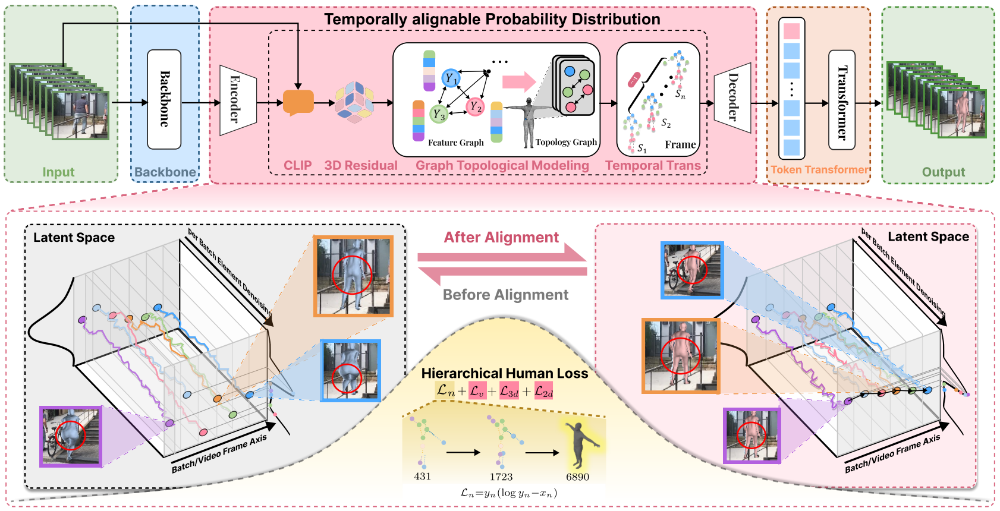

# TAG: Instructing Temporally Guided Probability to Align Graph Topological Modeling for Ambiguous 3D Human Pose and Shape Estimation
## Code and more Demo will be uploaded soon !!!

## Pipeline of TAG

## Result of Ambiguous Image
This repository provides several experimental results:

## Supplementary Gif Demo

    
    
    

    
    
    

    
    
    

